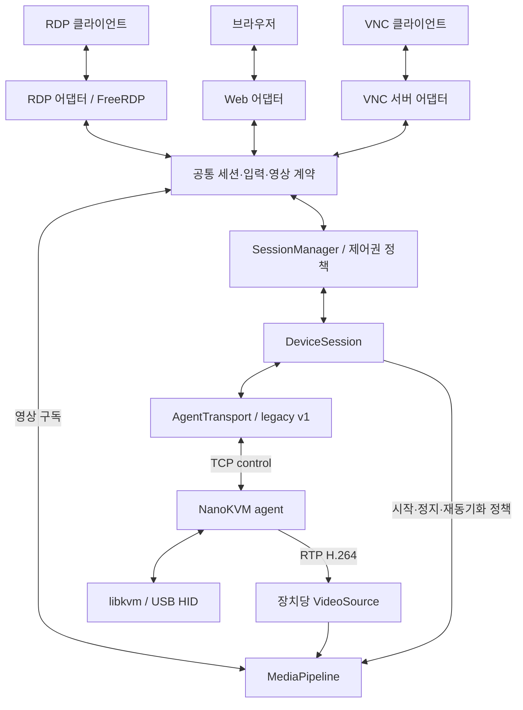

# 다중 프로토콜 게이트웨이 리팩토링안

작성일: 2026-09-29. 기준: `f374eab` 및 현재 작업 트리.
현재 수정 중인 README.md, deploy/S100nanokvm-agent, src/agent.c를 포함해 구조를 검토했다. 이 문서는 설계 제안이며 구현이나 운영 변경을 수행하지 않는다.

## 1. 제안

**에이전트 연결을 소유하는 DeviceSession을 중심으로, 사용자 프로토콜 어댑터와 장치 통신 어댑터를 분리한다.** FreeRDP는 RDP 어댑터 내부에만 남긴다. 입력은 프로토콜 중립 이벤트로, 영상은 압축 H.264와 디코딩 프레임의 두 경로로 제공한다.

C 사용에 따른 소유권·동시성 관리 부담은 있지만, 현재 확장을 막는 직접 원인은 언어보다 책임과 수명의 결합이다. 따라서 전체 재작성 대신 다음 순서를 권고한다.

1. 현재 C 구현에서 경계와 회귀 테스트를 확보한다.
2. gateway의 세션·정책·통신 오케스트레이션을 Rust로 단계적으로 이전한다. 이는 권고안이며 팀의 Rust 운영 경험을 확인해야 한다.
3. FreeRDP와 기존 미디어 구현은 좁은 C ABI 뒤에 유지한다. NanoKVM agent의 하드웨어 코드는 우선 C로 유지한다.
4. 같은 계약을 사용하는 두 번째 사용자 프로토콜을 구현해 확장성을 검증한다.

초기에는 기존 1개 장치·1개 사용자 세션 정책과 실행 파일 이름, 포트, CLI를 유지한다. 다중 프로토콜 지원과 다중 사용자 동시 제어는 별개 기능이다. 웹 제어는 우선 브라우저 화면 조회와 키보드·마우스 제어로 해석하며, 전원 관리·가상 미디어·클립보드는 별도 범위로 둔다.

## 2. 코드에서 확인한 결합

| 위치 | 현재 책임과 문제 | 이동할 경계 |
| --- | --- | --- |
| src/main.c:94 `Server` | control socket, heartbeat, ACK, `Client* active`, WinPR 동기화 객체를 함께 소유 | DeviceSession, AgentTransport, SessionManager |
| src/main.c:119 `Client` | `rdpContext`, FreeRDP codec, `AVFrame`, 입력 상태, SPS/PPS, 영상 스레드 혼재 | RdpSession, MediaPipeline, InputRouter |
| src/main.c:240 `control_thread` | HELLO·KEY_ACK·STATS·재연결 시 스트림 복구 | AgentTransport + DeviceSession |
| src/main.c:346 `server_heartbeat` | 장치 장애를 감지한 뒤 `freerdp_peer->Disconnect` 직접 호출 | 장치 이벤트 발행 → 세션 정책 → RDP 종료 요청 |
| src/main.c:765 / 1259 영상 스레드 | RDP 클라이언트마다 RTP 소켓을 열고 장치 영상 수신 | 장치당 단일 수신원 + 소비자 구독 |
| src/main.c:1176 / 1199 | 디코딩 결과 보관·변환·RDP pacing 결합 | 공통 미디어 소유권과 RDP 전송 정책 분리 |
| src/main.c:1345 이후 입력 콜백 | RDP 이벤트에서 agent wire payload를 직접 생성 | RDP 입력 변환 → 공통 입력 → agent wire 변환 |
| src/main.c:1644 `client_context_free` | RDP 해제가 장치 STOP_STREAM·RELEASE_ALL을 직접 결정 | 세션 관리자에서 구독·제어권 회수 |
| src/hid.c / hid.h | USB 장치 I/O와 RDP scan code·pointer flag 해석이 혼재 | agent HID 실행부와 레거시 입력 변환 분리 |
| src/protocol.c / protocol.h | wire framing과 socket I/O 제공, 입력 의미는 RDP 계열 표현 | legacy v1 codec으로 보존, 공통 도메인과 분리 |
| CMakeLists.txt | gateway 실행 타깃에 여러 계층 소스를 직접 연결 | 계층별 라이브러리와 빌드 의존성 검사 |
| tests/agent_send_test.c | agent.c 전체를 include하고 main/sendto 치환 | 추출한 전송 모듈에 I/O 주입 |

`foldvnc_client.c`는 현재 CMake gateway 타깃에 포함되지 않은 기존 영상 수신 클라이언트다. 이것을 사용자에게 서비스를 제공하는 VNC 서버 어댑터로 간주하면 안 된다.

## 3. 목표 구조



초기 배포 단위는 지금과 동일한 gateway + agent 두 프로세스다. 모듈 분리만으로도 목적을 달성할 수 있으므로 첫 단계에 FreeRDP 별도 프로세스, 메시지 브로커, 동적 플러그인 로더를 추가하지 않는다. FreeRDP 충돌의 프로세스 격리가 필요해지면 동일 계약을 IPC로 옮기는 후속안을 검토한다. 모듈 격리 자체는 네이티브 충돌 격리를 보장하지 않는다.

공통 코어에는 FreeRDP/WinPR 타입, RDP flag, agent 메시지 번호, FFmpeg 타입을 노출하지 않는다. 코어가 포트 인터페이스를 정의하고 구현 어댑터가 이를 의존한다. 실행 진입점만 구체 구현을 조립한다.

## 4. 경계와 계약

### DeviceSession / AgentTransport

- DeviceSession은 장치 연결 상태, 연결 세대(epoch), 스트림 수요, capabilities를 소유한다. 사용자 연결보다 오래 살아 있다.
- AgentTransport는 TCP accept, HELLO, framing, 전송 직렬화, heartbeat I/O, ACK 상관관계, 종료를 담당한다. 현재 agent가 gateway에 접속하는 방향을 보존한다.
- VideoSource는 장치당 RTP 소켓 하나를 소유한다. 사용자 프로토콜이 UDP 포트를 직접 bind하지 않는다.
- 장치 장애는 `DeviceDisconnected(reason, epoch)`로 전달한다. SessionManager가 기존 정책에 따라 사용자 세션 종료를 요청한다. 통신 모듈은 FreeRDP 포인터를 보유하지 않는다.
- TCP 재연결 시 epoch를 증가시키고 이전 ACK·입력·영상 작업을 무효화한다. RTP reassembly와 decoder를 초기화하고 새 SPS/PPS·IDR부터 재개한다.
- v1 RTP에는 control epoch와의 인증된 연결 관계가 없으므로 로컬 epoch만으로 지연 패킷을 완전히 판별할 수 없다. 초기에는 송신 endpoint/SSRC 검증, 수신 버퍼 정리, IDR 대기를 적용하고, 엄격한 결합은 후속 wire 확장으로 설계한다.

### SessionManager / InputRouter

최초에는 모든 프로토콜을 합쳐 활성 세션 하나만 허용한다. 두 번째 세션은 명확한 busy 결과를 받는다. 이후 관찰자 다중 접속을 추가할 때도 제어권은 장치당 하나의 lease로 유지한다.

제안 API의 의미는 다음과 같다. 실제 언어별 서명은 구현 단계에서 확정한다.

```text
open_session(device, frontend_capabilities) -> SessionHandle | Busy | Offline
submit_input(session, lease_epoch, InputEvent) -> Queued | Unsupported | Offline | Overflow
subscribe_video(session, EncodedH264 | DecodedFrame) -> Subscription
request_keyframe(subscription, reason)
close_session(session, reason)
```

- `Queued`는 gateway 수락을 뜻한다. AgentAccepted, UsbSubmitted, 호스트의 실제 처리 완료를 혼동하지 않는다. 현재 KEY_ACK는 `hid_scancode`의 반환값이며 최종 호스트 처리 ACK가 아니다.
- 정상 종료·제어권 회수 시 새 입력을 먼저 차단하고 stale 입력 취소 및 RELEASE_ALL을 수행한다. 장치 단절 시 원격 해제 도착은 보장할 수 없으므로 agent의 연결 종료 안전 해제가 마지막 방어선이다.
- `Synchronize`는 앞선 입력을 보존하는 순서 있는 중립화다. 장애 복구 `ReleaseAll`과 합치지 않는다.
- 첫 영상 구독이 생길 때 수신 준비 후 START_STREAM, 마지막 구독 제거 시 STOP_STREAM을 결정한다. 향후 관찰자가 남아 있으면 제어자 이탈만으로 영상을 정지하지 않는다.

### 프로토콜 중립 입력

```text
Key(USB HID usage page, usage, down)
Text(UTF-8)
PointerAbsolute(x, y, source_width, source_height, buttons)
PointerRelative(dx, dy, buttons)
Wheel(horizontal_steps, vertical_steps)
Synchronize
ReleaseAll(reason)
```

절대 좌표는 원본 화면 픽셀 기준, 범위는 0..width-1 / 0..height-1로 정의한다. 사용자 화면의 확대·여백·축소 좌표는 frontend에서 변환한다. 버튼 비트, 휠 부호와 한 step의 의미를 계약에서 고정한다. 키 반복, 미지원 키, modifier 처리, 텍스트 지원 범위도 계약 테스트로 고정한다.

RDP scan code, 브라우저 물리 키 코드, VNC keysym은 각 어댑터에서 변환한다. VNC keysym에서 물리 키로의 역변환은 키보드 레이아웃에 따라 모호하므로 레이아웃 정책과 미지원 결과가 필요하다. 임의의 국제 문자 입력 가능성을 약속하지 않는다.

**v1 호환 전략:** 기존 agent는 scan code와 RDP 계열 포인터 플래그를 받는다. 먼저 AgentTransport의 legacy 입력 codec이 중립 이벤트를 v1 표현으로 변환한다. 지원 가능한 매핑만 허용하고 불가능한 입력은 Unsupported로 반환한다. 기존 RDP의 특수 키·E0/E1 구분에서 손실이 발생하면 v1 전용 호환 경로를 어댑터 내부에 유지하거나 중립 키 식별자를 보완한 후 전환한다. 공통 이벤트에 raw RDP flags를 넣어 문제를 숨기지 않는다.

장기적으로는 capability 협상 후 HID usage 기반 입력 메시지를 추가한다. 기존 메시지 번호·payload 의미를 재정의하지 않고, 구형 agent에는 기존 v1 경로를 사용한다. 이 wire 변경은 구조 추출과 별도 릴리스로 진행한다.

### MediaPipeline

공통 영상 API를 BGRA 한 종류로 만들면 H.264 passthrough를 잃는다. 두 경로를 유지한다.

| 경로 | 계약 | 예상 소비자 |
| --- | --- | --- |
| EncodedVideo | 완전한 Annex-B access unit, codec configuration, keyframe 여부, timestamp/timebase, frame id, stream epoch, geometry | RDP AVC420, 향후 웹 영상 구현 |
| DecodedVideo | 불변 frame handle, geometry/format, 시각 정보, 필요할 때 요청하는 픽셀 변환 | RDP bitmap/Progressive, VNC, 초기 웹 화면 |

EncodedVideo는 참조 수명 동안 불변이다. DecodedVideo는 opaque 참조 핸들을 사용해 AVFrame을 미디어 구현 내부에 숨긴다. 소비자는 retain/release 또는 언어의 동등한 소유권 규칙을 따른다. BGRA 변환 결과도 참조가 남아 있는 동안 재사용 버퍼로 덮어쓰지 않는다.

기존의 '참조 프레임은 디코딩하고, 최신 디코딩 프레임만 보관하며, 실제 전송할 때 변환' 정책을 유지한다. decoded 소비자가 없으면 decoder를 쉬게 할 수 있지만, 다시 시작할 때 codec config와 IDR을 확보해야 한다.

- decoded 대기 슬롯은 소비자별 최신 1개로 제한한다. 마지막 화면은 후속 프레임이 없다는 이유로 버리지 않는다.
- encoded 큐는 바이트·개수 상한을 둔다. 임의의 P-frame 하나만 버리고 다음 P-frame을 계속 전송하지 않는다. overflow나 참조 손실 시 해당 소비자를 IDR 대기 상태로 바꾸고 재동기화한다.
- 느린 소비자는 다른 소비자의 수신·디코딩·입력을 막지 않는다. keyframe 요청은 장치별로 병합·제한한다.
- 현재 IDR_REQUEST는 즉시 키프레임을 생성하지 않고 다음 인코더 IDR을 기다린다. 복구 목표 시간은 실제 GOP에 맞춰 측정한다.
- RDP frame ACK, Progressive pacing, bitmap diff, codec negotiation은 RdpSession에 남긴다. 공통 코어는 bounded queue와 구독 수명만 관리한다.
- agent/수신/디코딩/전송 시각은 서로 다른 clock domain임을 표기한다. 현재 로그만으로 종단 지연을 계산하지 않는다.

## 5. 동시성·종료 규칙

장치 제어 상태는 단일 실행 문맥에서 직렬화하고, 입력 큐는 유한 크기로 둔다. 네트워크 I/O 또는 frontend callback을 코어 lock을 잡은 상태에서 실행하지 않는다. RDP 호출은 해당 어댑터가 정한 소유 스레드에서 수행한다.

입력 큐 초과 시 키 해제를 조용히 버리지 않는다. 오래된 입력을 취소하고 제어권 회수·안전 해제를 수행한다. ReleaseAll을 일반 입력 큐 포화 때문에 enqueue하지 못하는 상황이 없도록 별도 취소 신호 또는 예약 용량을 둔다. 이동 병합은 버튼 변화 없는 인접 이동에만 적용한다.

종료 순서는 신규 입력 차단 → 구독/lease 취소 → 대기 I/O 깨우기 → worker 종료 확인 → callback 해제 → 버퍼·세션 해제다. join timeout만으로 실행 중인 worker의 메모리를 해제하지 않는다. Rust FFI에서는 opaque handle, 고정 폭 정수, 명시적 release, callback 해제 완료 조건을 사용하고 panic이 C 경계를 넘지 않게 한다.

## 6. 언어·모듈 배치

| 선택 | 장점 | 부담 | 판단 |
| --- | --- | --- | --- |
| C 모듈화 유지 | 기존 장치·도구체인·코드 재사용 | 수명·경쟁 상태 검증 부담 지속 | 첫 단계에 사용 |
| Rust 코어 + C 어댑터 | 상태·소유권을 명시하고 네이티브 코드를 점진 재사용 | FFI, 빌드 통합, 팀 학습 | 목표 구조로 권고 |
| Go 코어 + C 어댑터 | 네트워크 서비스 구현이 편리할 수 있음 | cgo callback/미디어 수명 경계를 별도 관리 | 팀 경험이 Go 중심이면 대안 |
| 전체 재작성 | 언어 통일 | 입력 복구·영상 pacing·장치 동작의 회귀 범위가 큼 | 이번 계획에서 제외 |

특정 외부 바인딩이나 Web/VNC 라이브러리는 아직 선정하지 않았다. 실제 버전, 라이선스, 플랫폼 빌드, callback·프레임 수명 API를 확인하는 기술 검증 후 결정한다.

C 단계의 목표 배치:

```text
src/app/                  CLI, 설정, 구체 구현 조립
src/core/                 device_session, session_manager, input, contracts
src/adapters/rdp/          FreeRDP listener/session/input/render
src/adapters/agent_v1/     control transport, wire/input codec
src/media/                RTP source, H.264, decoder, frame ownership
src/agent/                device runtime, capture, HID execution
src/shared/               agent/gateway가 공유하는 wire framing
```

Rust 이전 시 core/app 및 agent transport 정책을 workspace crate로 옮기고, 네이티브 구현은 별도 native 라이브러리로 유지한다. 공통 헤더가 FreeRDP/WinPR/FFmpeg를 include하지 않는지 빌드로 검사한다. RDP 비활성화 빌드에는 FreeRDP 탐색·링크가 없어야 하며, 압축 영상 전용 빌드는 FFmpeg 없이 가능하게 만든다.

## 7. 단계별 실행과 완료 기준

| 단계 | 작업 | 완료 기준 및 되돌리기 |
| --- | --- | --- |
| 0. 기준선 | 현재 작업 변경을 별도로 보존·식별하고 기존 CTest, gateway/agent 빌드, 장치 입력·영상 기준 측정 | 재현 명령과 환경 기록. 구조 변경 전 상태로 롤백 가능 |
| 1. AgentTransport 추출 | main.c의 control I/O·HELLO·ACK·heartbeat 분리. legacy v1 그대로 유지 | fake agent로 부분 수신·전송 실패·heartbeat·재연결 검증. FreeRDP 없이 모듈 빌드 |
| 2. 세션·입력 분리 | DeviceSession/SessionManager 도입, 입력 정규화·v1 변환, RDP 소유권 분리 | mock frontend로 입력·동기화·종료 실행. 기존 RDP 입력 회귀 유지 |
| 3. 영상 분리 | 장치 단일 RTP 수신, 두 영상 계약, frame 소유권·소비자 큐 구현 | AVC420 및 bitmap/Progressive 모두 동작. mock slow consumer가 다른 경로를 막지 않음 |
| 4. Rust 코어 이전 | 단계 1~3 계약을 고정한 후 상태·정책 이전. C bridge 최소화 | 동일 계약 테스트가 이전 전후 통과. FFI 수명·종료 sanitizer 검증. 이전 C 바이너리로 롤백 |
| 5. 두 번째 frontend | 기본 제안은 VNC 서버의 화면·키·포인터 최소 기능. 웹이 우선이면 순서 교체 | core와 agent wire 변경 없이 어댑터와 조립 설정만 추가해 동작 |
| 6. Web·선택 확장 | 브라우저 제어, 필요 시 관찰자 다중 구독, 이후 agent 중립 입력 확장 | 기능별 capability·호환성 테스트와 독립 롤백 |

단계 1~3은 각각 여러 작은 PR로 나눈다. 파일 이동, 정책 변경, 언어 전환을 한 PR에 섞지 않는다. 5단계는 3단계 직후 C 코어에서도 수행할 수 있으며, 이를 먼저 하면 Rust 전환 전에 추상화의 적합성을 검증할 수 있다. 실무 권고 순서는 **0 → 1 → 2 → 3 → 최소 두 번째 frontend → 4 → 나머지 확장**이다.

웹 첫 구현은 필요 화질·지연에 따라 정한다. 화면 snapshot + 제어 채널은 경계 검증에는 유용하지만 운영용 원격 데스크톱 성능의 증명이 아니다. 저지연 영상에 WebRTC 등을 선택한다면 브라우저 협상·인증·전송 계층을 별도로 구현해야 하며, 현재 RTP/Annex-B를 브라우저에 그대로 전달한다고 동작하는 것으로 가정하지 않는다.

## 8. 검증 계획

기존 테스트의 범위를 보존한다: protocol/HID/H.264 단위 테스트, input_reliability, hid_keepalive, agent_send, rtp_client/loopback, frame_flow, frame_trace, bitmap_diff. FFmpeg 의존 테스트는 별도 미디어 검증으로 실행한다.

새 경계 검증은 다음 시나리오에 집중한다.

- fake agent: 분할 TCP, malformed payload, HELLO 호환, ACK 지연·실패·이전 epoch, 재연결, 쓰기 중 단절.
- 입력: RDP round-trip 매핑, 좌우 modifier, Control+Space, Alt/Command 교환, 혼합 절대·상대 이동, 버튼 해제, Unicode 지원 범위, Synchronize 순서, 큐 초과.
- 세션: RDP 접속 중 VNC 접속 거부, 종료 후 제어권 회수, 장치 timeout 시 모든 자원 반환, 재연결 후 stale 입력 재생 금지.
- 영상: packet loss·AU 단절·IDR 복구, codec config/해상도 변경, decoded 최신 프레임 보존, encoded overflow 복구, 느린 소비자 격리.
- 수명: pending callback 도중 종료, decode/네트워크 대기 중 종료, 반복 연결·해제, 이중 해제 및 UAF 검사.
- 의존성: core 계약 테스트가 FreeRDP·FFmpeg·장치 없이 실행되고, RDP 제외 빌드가 FreeRDP 없이 성공.
- 실장치: 실제 RDP 클라이언트의 입력·focus 복구 및 양쪽 영상 모드, 새 frontend, 30분 반복 조작과 재연결을 확인한다. 자동 테스트만으로 USB 호스트 입력 완료를 입증하지 않는다.

성능은 같은 장치·해상도·bitrate·GOP·클라이언트·네트워크·화면 시나리오에서 비교한다. 사용자 확정 요구사항은 **리팩토링 이후 동일하거나 더 좋은 성능**이다. 영상 지연 p50/p95 증가나 동일 품질에서 FPS 감소를 허용하지 않는다. 측정 불확실성이 크면 판정을 보류하며 10% 악화를 허용 기준으로 삼지 않는다. 대기 큐는 설정 상한 이하, 재연결 반복 후 RSS는 지속 증가하지 않아야 한다. [벤치마크 절차와 승인 기준](measurements/README.md)에 따라 변경 전후를 비교한다. 최초 20개 관측은 보존하되 정식 성능 승인 전에 동일 조건의 정밀 기준선을 추가한다. CPU·RSS·변환 횟수·프레임 drop·입력 overflow를 함께 기록한다. 설계만으로 성능 개선을 약속하지 않는다.

초기 추출 단계는 agent wire를 바꾸지 않아 gateway 단독 롤백이 가능해야 한다. 새 capability 도입 단계는 agent 선행 배포 → gateway 활성화 순서를 사용하며, 지원하지 않는 agent에는 기존 동작을 유지한다.

## 9. 범위와 남은 결정

이번 구조 리팩토링에 포함할 것은 경계 추출, 입력·영상 계약, 수명 및 오류 정책, 독립 테스트와 빌드다. 다중 장치 라우팅, 임의 동시 제어, 자동 배포, 새 인증 프로토콜은 별도 작업이다.

웹/VNC를 외부에 공개하기 전에는 사용자 인증과 제어권 권한을 공통 세션 진입점에서 검증해야 한다. 현재 agent control/video 채널에 인증이 없다는 기존 제약도 유지되므로, 신뢰 네트워크 밖으로 확장할 때 agent 인증과 영상 세션 결합을 별도 설계한다.

구현 착수 전에 확정하면 좋은 항목은 팀의 Rust/Go 선호와 운영 역량, 웹과 VNC 중 우선순위, 동시 관찰자 필요 여부, 지원 키보드 레이아웃이다. 이 결정 전에도 단계 0~3의 경계 추출은 진행할 수 있다.

리팩토링 성공 기준은 main.c의 줄 수 감소가 아니라 **FreeRDP 없이 장치 통신과 세션 정책을 검증하고, agent 코드를 바꾸지 않고 두 번째 사용자 프로토콜을 연결하는 것**이다.
